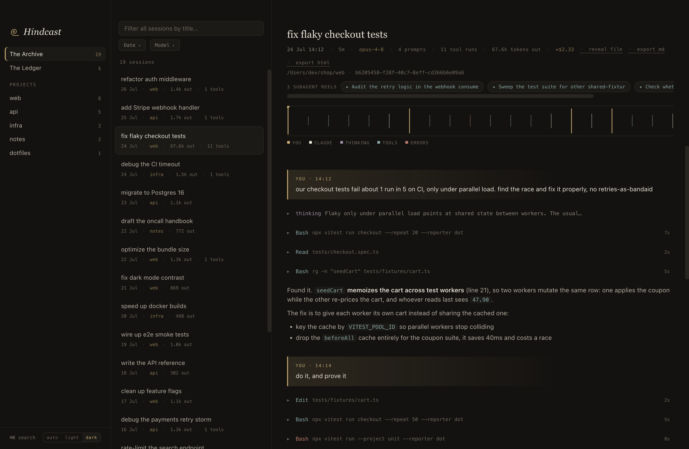

<p align="center">
  
</p>

<p align="center">
  <b>Every Claude Code session you've ever run. Indexed, searchable, scrubbable.</b>
</p>

<p align="center">
  <a href="https://github.com/karanb192/hindcast/releases"></a>
  
  <a href="LICENSE"></a>
</p>

<p align="center">
  Find that session from three weeks ago, scrub through what the agent did,
  and resume it in your terminal with one paste. Local-first: it reads the
  transcripts Claude Code already writes to <code>~/.claude/projects/</code>,
  and nothing leaves your Mac.
</p>

<p align="center">
  
</p>

My own archive, as of August 2026: 114 sessions across 65 projects, half a
gigabyte of JSONL, 17M output tokens, reaching back to April. Hindcast
cold-indexes all of it in about 4 seconds on an M3 Pro, then keeps the index
fresh as new sessions land.

## The 30-second film

https://github.com/user-attachments/assets/3d784ee4-add6-4716-b668-877af637b925

## Install

```bash
brew tap karanb192/tap
brew trust karanb192/tap
brew install --cask hindcast
brew install ripgrep    # search engine; without it ⌘K matches titles only
xattr -rd com.apple.quarantine /Applications/Hindcast.app
```

Apple Silicon only for now. The `xattr` step is needed because the app isn't
notarized yet (Developer ID enrollment in progress); it disappears in an
upcoming signed release. Prefer a download? Grab the DMG from
[Releases](https://github.com/karanb192/hindcast/releases).

One thing worth doing today: Claude Code prunes transcripts by file age,
`cleanupPeriodDays` in `~/.claude/settings.json`, default 30 days. Hindcast
can only index what still exists. Mine is set to 60, which is why the archive
above still reaches April: those sessions kept getting resumed, so their
files stayed young. Raise yours before the pruner gets to your history.

## What you get

- **⌘K search across everything**: full text over every transcript, tool
  output included. Opening a result jumps the tape straight to the matched
  event.
- **The tape**: every event drawn as a tick (brass = you, ivory/ink = Claude,
  violet = thinking, teal = tools, brick = errors). Click or drag to scrub;
  the playhead follows your scroll.
- **Resume from the archive**: every session header has a `resume` chip that
  copies `cd -- <project dir> && claude --resume <session id>`, ready to
  paste into a terminal. The command is a template you can edit in place, so
  shell aliases work (`cd {cwd} && ccr {sessionId}` if that's your thing).
- **The Ledger**: a [ccusage](https://github.com/ryoppippi/ccusage)-style
  usage and cost view: per-day / per-week / per-month tables with per-model
  breakdowns, estimated dollar cost at published API rates, and a last-7-days
  figure.
- **The Skills**: which installed skills actually fire, and which never do;
  see below.
- **Instant filtering**: type-to-filter the session list by title with zero
  keystroke lag, plus date presets, a custom range, and a model multi-select.
  Filters drive both the list and the Archive stats.
- **Export**: any session to markdown or self-contained HTML (active branch,
  images inlined), into `~/Downloads/Hindcast Exports`.
- **Subagent reels**: sessions list their subagent transcripts, including
  workflow-nested ones under `subagents/workflows/wf_*/`; each opens as its
  own tape with a back link.
- **Dark, light, and auto themes**, persisted so the window paints the right
  color from the first frame.

## Which skills actually fire

Skills are install-and-forget: every one you add loads into context each
session, and nothing tells you which ones ever run. Anthropic closed the
[skill analytics request](https://github.com/anthropics/claude-code/issues/35319)
as not planned, so people prune by gut feeling or not at all. When I finally
counted, 5 of my 17 installed skills had never fired once.

The Skills page reads the answer out of the transcripts and opens with it:
"Of 43 installed skills, 12 have never fired." Below that, every skill with
how often it fired, split by whether Claude loaded it or you typed the slash
command, distinct sessions, first and last fired, and a 12-month trend.
Installed skills that never fired get called out, so do ones idle for 60+
days. Counts are deduplicated across forked and resumed sessions, the
double-count trap that catches naive counters. And a count here is not the
end of the story: expand a skill, click a session, and the tape lands on the
exact invocation.

## Run from source

Requires Node 18+:

```bash
git clone https://github.com/karanb192/hindcast.git
cd hindcast
npm install
npm start
```

If Electron's binary fails to download during install (npm script protection),
run `node node_modules/electron/install.js` once, then `npm start`.

To install it as a proper app, `npm run pack` builds `Hindcast.app` into
`dist/mac-arm64/`; drag it to /Applications.

## How it works

- **Indexer** (`lib/scanner.js`): streams every top-level `*.jsonl`
  transcript, extracts the session title (custom-title > ai-title > first
  prompt), timestamps, models, token usage, and tool counts. Results are
  cached by file mtime + size + format version in the app's user-data dir,
  and an fs.watch re-index keeps the list current while you work.
- **Search** (`lib/search.js`): shells out to
  [ripgrep](https://github.com/BurntSushi/ripgrep) across all transcripts
  (also matching the JSON-escaped spelling of queries containing quotes or
  backslashes), then re-reads only the matching lines to build snippets.
- **Transcripts are trees**, not lists: rewinds fork branches. The viewer
  follows the `leafUuid` pointer from the transcript's `last-prompt` line
  (falling back to the last message), shows only the live conversation, and
  reports how many rewound events it hid. Renders markdown, collapsible
  thinking, tool cards with inline screenshot results, pasted images,
  compaction markers, and model-fallback notes.
- **Usage dedup**: one API response spans several JSONL lines that each
  repeat the same usage object, and resumed or forked sessions copy history
  verbatim. So usage is deduplicated globally by message id across every
  file, subagent transcripts included, the same approach ccusage takes.
  Cache reads priced at 0.1x, 5-minute cache writes at 1.25x, 1-hour writes
  at 2x (`lib/pricing.js`). Costs are estimates of API-equivalent value, not
  an invoice.
- The transcript format is officially internal to Claude Code, so parsing is
  deliberately tolerant: unknown line types and block types are skipped,
  never fatal.

## Design

"A reading room for machine work." Warm darkroom / warm paper palettes,
New York serif for display type, SF Mono for the machine's voice, one brass
accent. No neon.

## Local-only, by construction

Hindcast reads `~/.claude/projects/` and writes to exactly two places, both
its own: its user-data dir (index cache, theme, settings) and
`~/Downloads/Hindcast Exports` when you click export. It never writes into
`~/.claude/`, makes no network requests of its own, and has no telemetry.
There is no API key to configure because it never calls Claude: it reads
files on disk, and that's the whole trick. The 2026 back-and-forth over
subscription auth for third-party agent tools
([latest round](https://venturebeat.com/technology/anthropic-reinstates-openclaw-and-third-party-agent-usage-on-claude-subscriptions-with-a-catch))
never applied to it.

## Known limitations

- An open session doesn't show new messages until you click away and back.
  Deliberate: a background refresh must never move your scroll position. The
  session list stays live either way.
- A search match on a rewound (abandoned) branch opens the session but can't
  jump to the hidden event.
- Apple Silicon only.

## Non-goals

- **Live streaming or monitoring of active sessions**: your terminal already
  shows the stream. Hindcast stays a read-only archive.
- **Orchestration and team/cloud sync**: local-first and read-only,
  permanently.

## Roadmap

- **Signed + notarized builds**: an unsigned DMG ships today; Developer ID
  enrollment is pending, and the `xattr` step dies with it.
- [Bundle ripgrep](https://github.com/karanb192/hindcast/issues/5) so search
  works with zero setup.
- [An opt-in vault](https://github.com/karanb192/hindcast/issues/3) so your
  archive survives Claude Code's 30-day auto-cleanup.
- [On-device semantic search](https://github.com/karanb192/hindcast/issues/19)
  behind the same ⌘K.

More ideas live in
[Issues](https://github.com/karanb192/hindcast/issues);
[CONTRIBUTING.md](CONTRIBUTING.md) covers the ground rules. If Hindcast dug
up a session you'd already given up on, a star helps other people find it.
